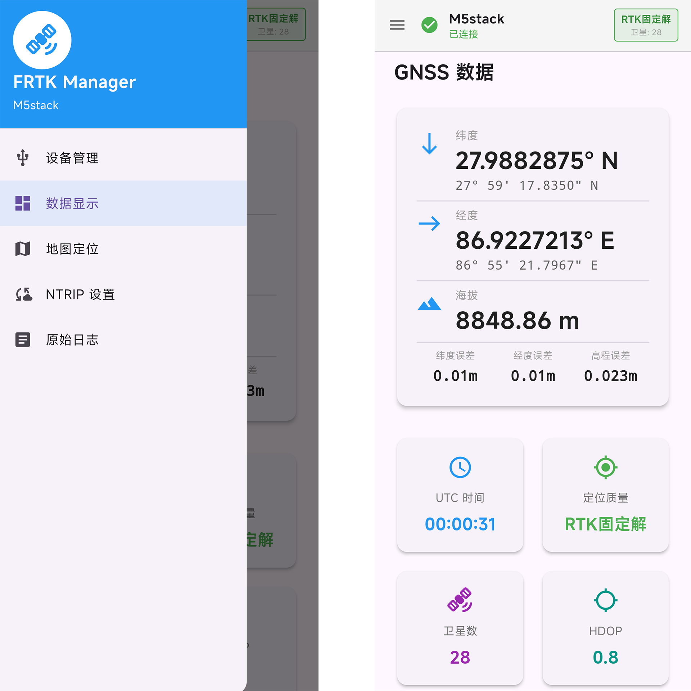

# FRTK

用于连接USB串口接收机进行GNSS/RTK定位的Flutter Android应用。

## Features

- 通过USB串口连接GNSS接收器
- 实时显示定位信息和状态
- 在地图上展示当前位置
- NMEA协议GGA GST解析
- 连接NTRIP服务获取差分数据 (进行RTK定位，需要接收机支持)

## Requirements

- Flutter 3.4
- flutter_map
- usb_serial

## Build

```bash
flutter pub get

flutter build apk --release
```

## Screenshots
